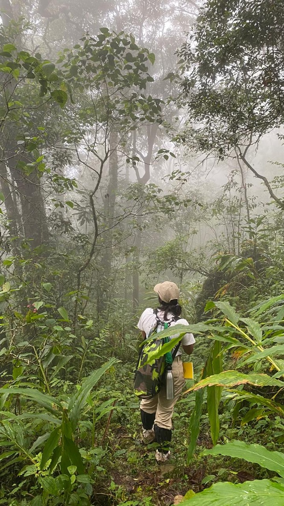

 

Contact: shanelle.wikramanayake@colostate.edu

PhD student in the [Funk Lab](https://sites.google.com/view/funklab/home?authuser=0) at Colorado State University, Fort Collins. 
I am an evolutionary ecologist with an interest in using integrative research to examine evolutionary processes and conserve threatened organisms in tropical rainforests. My research utilizes fieldwork, lab work, and computer science/bioinformatics. 
My primary research projects are: 

* Impacts of climate change and habitat fragmentation on organisms
* Role of female mate choice in lineage divergence
* Phylogeography of an endangered endemic lizard 

 